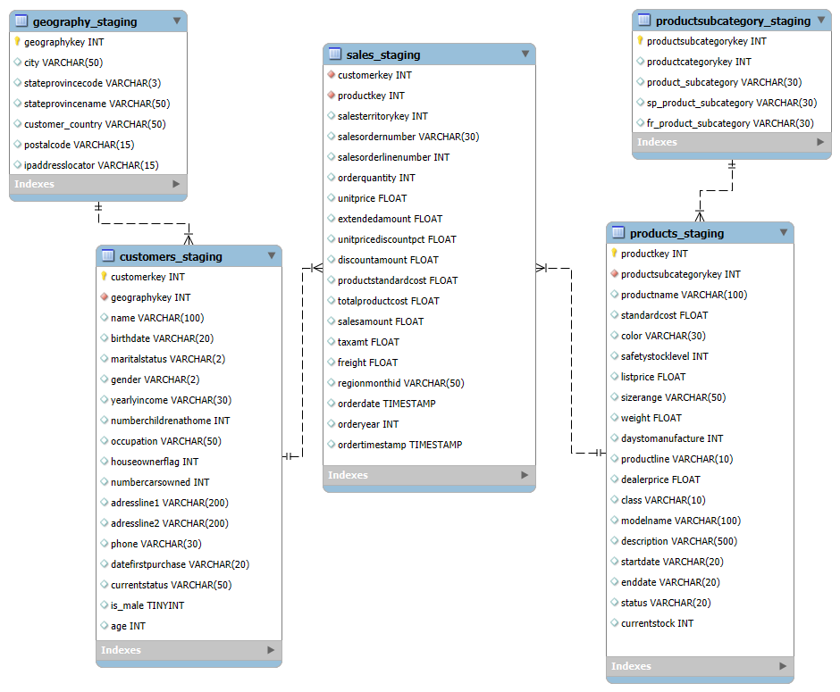
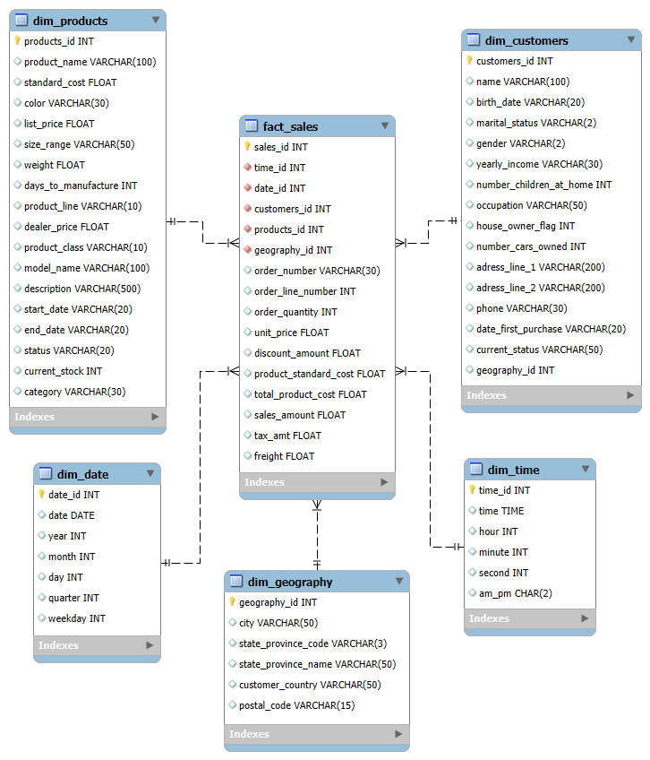
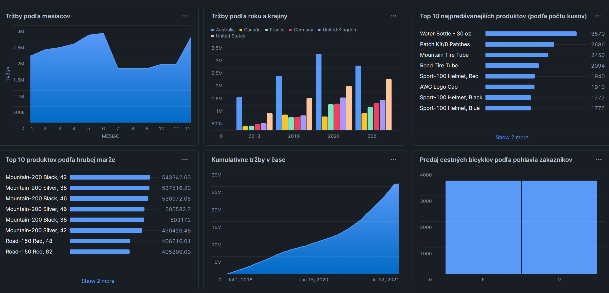

# ELT proces datasetu BikeSales

## 1. Úvod a popis zdrojových dát

V tomto projekte sa venujeme analýze predaja bicyklov v rôznych časových obdobiach a geografických oblastiach. Zvolený dataset sme si vybrali najmä preto, že je prehľadný, ľahko pochopiteľný a vhodný na analýzu z pohľadu času, produktov aj regiónov.

Dáta zachytávajú celý proces predaja bicyklov – od jednotlivých predajných záznamov až po informácie o produktoch, zákazníkoch, miestach predaja a finančných ukazovateľoch. Vďaka tomu je možné sledovať vývoj predaja, porovnávať úspešnosť jednotlivých produktov a analyzovať rozdiely medzi regiónmi.

Dataset obsahuje viacero typov údajov, konkrétne časové údaje (dátum predaja), produktové údaje (typ a kategória bicykla), geografické údaje (miesto predaja) a číselné údaje, ako sú tržby, množstvo predaných kusov a zisk.

Cieľom analýzy je najmä:
* sledovať, ako sa predaj bicyklov vyvíja v čase,
* identifikovať najpredávanejšie produkty a kategórie,
* porovnať predaje medzi jednotlivými regiónmi,
* analyzovať trendy v tržbách a zisku.

Zdrojové dáta pochádzajú zo Snowflake Marketplace, konkrétne z datasetu [Bike Sales – Sample Dashboard Synthetic Data](https://app.snowflake.com/marketplace/listing/GZ1M7Z2XJQI/astrato-bike-sales-sample-dashboard-synthetic-data?search=sales), ktorý obsahuje viacero tabuliek reprezentujúcich jednotlivé časti predajného procesu.

Dataset zahŕňa tieto tabuľky:
* `SALES` – obsahuje záznamy o jednotlivých predajoch vrátane dátumu, produktu, zákazníka, regiónu, množstva a finančných ukazovateľov. Táto tabuľka slúži ako základ pre faktovú tabuľku.
* `PRODUCTS` – obsahuje informácie o bicykloch, ako sú názov, kategória a ďalšie vlastnosti. Je zdrojom pre dimenziu produktov.
* `CUSTOMERS` – zahŕňa základné informácie o zákazníkoch a slúži na vytvorenie dimenzie zákazníkov.
* `GEOGRAPHY` – obsahuje geografické údaje o miestach predaja (napríklad mestá a krajiny), ktoré sú použité v dimenzii geografie.
* `PRODUCTSUBCATEGORY` – obsahuje produktové kategórie, ktoré rozširujú informácie v produktovej dimenzii.

Úlohou ELT procesu je tieto dáta prevziať zo Snowflake Marketplace, následne ich transformovať do dimenzionálneho modelu typu hviezda a pripraviť ich na analytické spracovanie a vizualizáciu z rôznych uhlov pohľadu.

***

### 1.1 Dátová architektúra
### ERD diagram
Zdrojové dáta z Snowflake Marketplace sú uložené v relačných tabuľkách. Ich základnú štruktúru a vzťahy medzi jednotlivými tabuľkami znázorňuje nasledujúci entitno-relačný diagram:


<div align="center">
  
  <p><i>Obrázok 1 Entitno-relačná schéma BikeSales</i></p>
</div>

***

## 2. Návrh dimenzionálneho modelu

Na základe pôvodnej štruktúry zdrojových dát bol navrhnutý dimenzionálny model typu Star Schema, ktorý vychádza z Kimballovej metodológie. Model je postavený tak, aby bol vhodný na analytické spracovanie dát a umožňoval jednoduché dotazovanie nad predajmi bicyklov.

Model pozostáva z jednej centrálnej faktovej tabuľky `fact_sales`, ktorá je prepojená s viacerými dimenziami. Takéto usporiadanie zjednodušuje analýzu dát a zvyšuje prehľadnosť celého dátového skladu.

#### 2.1 Faktová tabuľka

Tabuľka `fact_sales` zachytáva jednotlivé položky objednávok, teda každý predaný produkt v rámci objednávky.
Primárnym kľúčom tabuľky je `sales_id`. Tabuľka obsahuje cudzie kľúče na dimenzie `dim_date`, `dim_time`, `dim_customers`, `dim_products` a `dim_geography`.

Faktová tabuľka obsahuje najmä číselné údaje potrebné na analýzu predaja, napríklad:
* počet predaných kusov,
* jednotkovú cenu produktu,
* výšku zľavy,
* výslednú sumu predaja,
* daň a náklady na dopravu.

Súčasťou faktovej tabuľky sú aj window functions, ktoré umožňujú rozšírené analytické výpočty:
* výpočet celkovej hodnoty objednávky pomocou `SUM() OVER (PARTITION BY salesordernumber)`,
* výpočet kumulatívnej hodnoty predaja pre jednotlivých zákazníkov v čase pomocou `SUM() OVER (PARTITION BY customerkey ORDER BY orderdate)`.

#### 2.2 Dimenzie

Faktová tabuľka je prepojená s nasledujúcimi dimenziami:
* `dim_date` – obsahuje informácie o dátume predaja, ako je deň, mesiac, rok, štvrťrok a deň v týždni.
    * SCD Typ 0 – hodnoty v tejto dimenzii sa nemenia.

* `dim_time` – umožňuje analyzovať predaje podľa presného času (hodina, minúta, sekunda).
    * SCD Typ 0 – časová dimenzia je nemenná.

* `dim_customers` – obsahuje základné údaje o zákazníkoch a ich priradenie k geografickej oblasti.
    * SCD Typ 1 – zmeny údajov sa neukladajú historicky.

* `dim_products` – obsahuje informácie o bicykloch, ich vlastnostiach a produktových kategóriách.
    * SCD Typ 1 – uchováva sa iba aktuálny stav produktu.

* `dim_geography` – obsahuje geografické informácie o mieste predaja, ako sú mesto, štát a krajina.
    * SCD Typ 1 - historické zmeny geografických údajov sa neukladajú.

Všetky dimenzie sú prepojené s faktovou tabuľkou vzťahom 1 : N pomocou surrogate kľúčov, čo umožňuje jednoduché a efektívne vytváranie analytických dotazov.

Schéma hviezdy a prepojenia medzi jednotlivými tabuľkami sú znázornené na diagrame nižšie:


<div align="center">
  
  <p><i>Obrázok 2: Schéma hviezdy pre BikeSales</i></p>
</div>

***
## 3. ELT proces v Snowflake
ELT proces v tomto projekte pozostáva z troch hlavných krokov: `Extract` (extrahovanie), `Load` (načítanie) a `Transform` (transformácia). Dáta sú spracovávané priamo v prostredí Snowflake bez potreby externých súborov, keďže zdrojové dáta pochádzajú zo Snowflake Marketplace.
***
### 3.1 Extract a load (Extrahovanie a načítanie dát)
#### Extract
V kroku Extract sú dáta získané zo Snowflake Marketplace. Konkrétne ide o dataset [Bike Sales – Sample Dashboard Synthetic Data](https://app.snowflake.com/marketplace/listing/GZ1M7Z2XJQI/astrato-bike-sales-sample-dashboard-synthetic-data?search=sales), ktorý je dostupný v databáze:
* databáza: `BIKE_SALES__SAMPLE_DASHBOARD_SYNTHETIC_DATA`
* schéma: `BIKES_SALES`

Dáta sú extrahované priamo pomocou SQL príkazov `SELECT` a uložené do staging tabuliek, ktoré slúžia ako dočasná vrstva pre ďalšie spracovanie dát.

#### Load
V rovnakom kroku sú extrahované dáta zároveň načítané (loaded) do staging tabuliek v databáze projektu. Každá zdrojová tabuľka z Marketplace má svoju zodpovedajúcu staging tabuľku.
Staging tabuľky:
* `SALES_STAGING`
* `PRODUCTS_STAGING`
* `CUSTOMERS_STAGING`
* `GEOGRAPHY_STAGING`
* `PRODUCTSUBCATEGORY_STAGING`

Tieto tabuľky obsahujú nezmenené (surové) dáta zo zdrojového datasetu. V tejto fáze nedochádza k žiadnym úpravám dát, ide len o presnú kópiu zdrojových tabuliek.

Použité SQL príkazy:
```sql
CREATE OR REPLACE TABLE SALES_STAGING AS
SELECT * FROM BIKE_SALES__SAMPLE_DASHBOARD_SYNTHETIC_DATA.BIKES_SALES."1_SALES";

CREATE OR REPLACE TABLE PRODUCTS_STAGING AS
SELECT * FROM BIKE_SALES__SAMPLE_DASHBOARD_SYNTHETIC_DATA.BIKES_SALES."11_PRODUCTS";

CREATE OR REPLACE TABLE CUSTOMERS_STAGING AS
SELECT * FROM BIKE_SALES__SAMPLE_DASHBOARD_SYNTHETIC_DATA.BIKES_SALES."2_CUSTOMERS";

CREATE OR REPLACE TABLE GEOGRAPHY_STAGING AS
SELECT * FROM BIKE_SALES__SAMPLE_DASHBOARD_SYNTHETIC_DATA.BIKES_SALES."3_GEOGRAPHY";

CREATE OR REPLACE TABLE PRODUCTSUBCATEGORY_STAGING AS
SELECT * FROM BIKE_SALES__SAMPLE_DASHBOARD_SYNTHETIC_DATA.BIKES_SALES."5_PRODUCTSUBCATEGORY";

```
Po ich vytvorení sú dáta overené pomocou príkazov `DESCRIBE TABLE` a `SELECT`, čím sa zabezpečí, že boli načítané správne:
```sql
DESCRIBE TABLE SALES_STAGING;
SELECT * FROM SALES_STAGING;

DESCRIBE TABLE PRODUCTS_STAGING;
SELECT * FROM PRODUCTS_STAGING;

DESCRIBE TABLE CUSTOMERS_STAGING;
SELECT * FROM CUSTOMERS_STAGING;

DESCRIBE TABLE GEOGRAPHY_STAGING;
SELECT * FROM GEOGRAPHY_STAGING;

DESCRIBE TABLE PRODUCTSUBCATEGORY_STAGING;
SELECT * FROM PRODUCTSUBCATEGORY_STAGING;
```


### 3.2 Transform (Transformácia dát)
V transformačnej fáze boli dáta zo staging tabuliek upravené a preusporiadané do dimenzionálneho modelu typu Star Schema. Cieľom tejto fázy bolo pripraviť prehľadné dimenzie a faktovú tabuľku, ktoré umožnia jednoduchú analytickú prácu nad predajmi bicyklov.

Transformácia prebiehala priamo v prostredí Snowflake pomocou SQL príkazov. Počas tohto kroku boli dáta čistené, deduplikované, typovo upravené (casting) a rozdelené do samostatných dimenzií a faktovej tabuľky.
***
#### Dimenzia dátumu (dim_date)
Dimenzia `dim_date` bola vytvorená zo stĺpca orderdate v tabuľke `sales_staging`. Obsahuje odvodené časové atribúty, ako sú deň, mesiac, rok, štvrťrok a názov dňa v týždni. Použitím `SELECT DISTINCT` sa zabezpečilo, že každý dátum sa v dimenzii nachádza iba raz.
```sql
CREATE OR REPLACE TABLE dim_date AS
SELECT DISTINCT
    TO_CHAR(TO_DATE(orderdate), 'YYYYMMDD') AS date_id,
    TO_DATE(orderdate) AS date,
    YEAR(orderdate) AS year,
    MONTH(orderdate) AS month,
    DAY(orderdate) AS day,
    QUARTER(orderdate) AS quarter,
    CASE DAYNAME(orderdate)
        WHEN 'Mon' THEN 'Monday'
        WHEN 'Tue' THEN 'Tuesday'
        WHEN 'Wed' THEN 'Wednesday'
        WHEN 'Thu' THEN 'Thursday'
        WHEN 'Fri' THEN 'Friday'
        WHEN 'Sat' THEN 'Saturday'
        WHEN 'Sun' THEN 'Sunday' END AS weekday
FROM sales_staging;

SELECT * FROM dim_date;
```
Táto dimenzia je typu SCD Typ 0, keďže dátumové údaje sú nemenné a v čase sa nemenia. Nové záznamy sa do dimenzie iba dopĺňajú.
***
#### Dimenzia času (dim_time)
Dimenzia `dim_time` umožňuje analyzovať predaje podľa presného času objednávky. Z `ordertimestamp` boli odvodené atribúty ako hodina, minúta, sekunda a označenie AM/PM.
```sql
CREATE OR REPLACE TABLE dim_time AS
SELECT DISTINCT
    TIME(s.ordertimestamp)::TIME(0) AS time_id,
    TIME(s.ordertimestamp)::TIME(0) AS time,
    HOUR(s.ordertimestamp) AS hour,
    MINUTE(s.ordertimestamp) AS minute,
    SECOND(s.ordertimestamp) AS second,
    CASE 
        WHEN HOUR(s.ordertimestamp) < 12 THEN 'am' 
        ELSE 'pm' 
    END AS am_pm
FROM sales_staging s;

SELECT * FROM dim_time;
```
Rovnako ako pri dimenzii dátumu ide o SCD Typ 0, pretože časové údaje sú statické a nemenia sa.
***
#### Dimenzia geografie (dim_geography)
Dimenzia `dim_geography` bola vytvorená zo staging tabuľky `geography_staging` a obsahuje informácie o mieste predaja, ako sú mesto, štát, krajina a poštové smerovacie číslo. Každý geografický záznam je identifikovaný pomocou kľúča `geography_id`.
```sql
CREATE OR REPLACE TABLE dim_geography AS
SELECT DISTINCT
    geographykey AS geography_id,
    city,
    stateprovincecode AS state_province_code,
    stateprovincename AS state_province,
    customer_country,
    postalcode AS postal_code
FROM geography_staging;

SELECT * FROM dim_geography;
```
Dimenzia je navrhnutá ako SCD Typ 1, čo znamená, že prípadné zmeny geografických údajov by sa prepísali bez uchovávania historických hodnôt.
***
#### Dimenzia zákazníkov (dim_customers)
Dimenzia `dim_customers` obsahuje základné informácie o zákazníkoch, napríklad demografické údaje, príjem, povolanie a priradenie k geografickej oblasti. Dáta pochádzajú zo staging tabuľky `customers_staging`.
```sql
CREATE OR REPLACE TABLE dim_customers AS
SELECT DISTINCT
    customerkey AS customers_id,
    geographykey AS geography_id,
    name,
    birthdate AS birth_date,
    maritalstatus AS marital_status,
    gender,
    yearlyincome AS yearly_income,
    numberchildrenathome AS number_children_at_home,
    occupation,
    houseownerflag AS house_owner_flag,
    numbercarsowned AS number_cars_owned,
    addressline1 AS address_line_1,
    addressline2 AS address_line_2,
    phone,
    datefirstpurchase AS date_first_purchase,
    currentstatus AS current_status
FROM customers_staging;

SELECT * FROM dim_customers;
```
Táto dimenzia je typu SCD Typ 1, keďže historické zmeny údajov o zákazníkoch (napr. zmena adresy) nie sú pre účely analýzy sledované a uchováva sa iba aktuálny stav.
***
#### Dimenzia produktov (dim_products)
Dimenzia `dim_products` poskytuje informácie o bicykloch a ich vlastnostiach, ako sú názov produktu, farba, cena, veľkosť, hmotnosť, výrobný čas a kategória. Vznikla spojením staging tabuliek `products_staging` a `productsubcategory_staging`.
```sql
CREATE OR REPLACE TABLE dim_products AS
SELECT DISTINCT
    p.productkey AS products_id,
    p.productname AS product_name,
    p.standardcost AS standard_cost,
    p.color AS color,
    p.listprice AS list_price,
    p.sizerange AS size_range,
    p.weight AS weight,
    p.daystomanufacture AS days_to_manufacture,
    p.productline AS product_line,
    p.dealerprice AS dealer_price,
    p.class AS product_class,
    p.modelname AS model_name,
    p.description AS description,
    p.startdate AS start_date,
    p.enddate AS end_date,
    p.status AS status,
    p.currentstock AS current_stock,
    ps.product_subcategory AS category
FROM products_staging p
JOIN productsubcategory_staging ps ON ps.productcategorykey = p.productsubcategorykey;


SELECT * FROM dim_products;
```
Aj táto dimenzia je navrhnutá ako SCD Typ 1, pričom sa uchováva iba aktuálna verzia produktových údajov bez histórie zmien.
***
#### Faktová tabuľka predaja (fact_sales)
Faktová tabuľka `fact_sales` reprezentuje jednotlivé položky objednávok (order lines) a tvorí centrálny prvok hviezdicového modelu. Každý záznam obsahuje cudzie kľúče na všetky dimenzie (`dim_date`, `dim_time`, `dim_customers`, `dim_products`, `dim_geography`) a zároveň hlavné metriky súvisiace s predajom.

Primárnym kľúčom tabuľky je surrogate kľúč `sales_id`, ktorý bol vytvorený pomocou window function `ROW_NUMBER()`.

Vo faktovej tabuľke sú použité aj povinné window functions:
* výpočet celkovej hodnoty objednávky pomocou `SUM() OVER (PARTITION BY salesordernumber)`,
* výpočet kumulatívnej hodnoty predaja zákazníka v čase pomocou `SUM() OVER (PARTITION BY customerkey ORDER BY orderdate)`.

Tieto výpočty umožňujú pokročilé analytické pohľady na správanie zákazníkov a hodnotu objednávok.
```sql
CREATE OR REPLACE TABLE fact_sales AS
SELECT
    ROW_NUMBER() OVER (
        ORDER BY s.salesordernumber, s.salesorderlinenumber
    ) AS sales_id,
    t.time_id,
    d.date_id,
    c.customers_id,
    p.products_id,
    g.geography_id,
    s.salesordernumber AS order_number,
    s.salesorderlinenumber AS order_line_number,
    s.orderquantity AS order_quantity,
    s.unitprice AS unit_price,
    s.discountamount AS discount_amount,
    s.productstandardcost AS product_standard_cost,
    s.totalproductcost AS total_product_cost,
    s.salesamount AS sales_amount,
    s.taxamt AS tax_amount,
    s.freight AS freight_amount,
    //celková hodnota objednávky
    SUM(s.salesamount) OVER (
        PARTITION BY s.salesordernumber
    ) AS order_total_sales_amount,
    //kumulatívna hodnota zákazníka
    SUM(s.salesamount) OVER (
        PARTITION BY s.customerkey
        ORDER BY s.orderdate
        ROWS BETWEEN UNBOUNDED PRECEDING AND CURRENT ROW
    ) AS customer_running_sales_amount
FROM sales_staging s
JOIN dim_date d ON d.date_id = TO_CHAR(TO_DATE(s.orderdate), 'YYYYMMDD')
JOIN dim_time t ON t.time_id = TIME(s.ordertimestamp)::TIME(0)
JOIN dim_customers c ON c.customers_id = s.customerkey
JOIN dim_products p ON p.products_id = s.productkey
JOIN dim_geography g ON g.geography_id = c.geography_id;

SELECT * FROM fact_sales;
```
***
#### Vyčistenie staging vrstvy
Po úspešnom vytvorení dimenzií a faktovej tabuľky už staging tabuľky neboli ďalej potrebné. Z tohto dôvodu boli odstránené pomocou príkazov `DROP TABLE IF EXISTS`, čím sa optimalizovalo využitie úložiska v Snowflake.
```sql
DROP TABLE IF EXISTS SALES_STAGING;
DROP TABLE IF EXISTS PRODUCTS_STAGING;
DROP TABLE IF EXISTS CUSTOMERS_STAGING;
DROP TABLE IF EXISTS GEOGRAPHY_STAGING;
DROP TABLE IF EXISTS PRODUCTSUBCATEGORY_STAGING;
```

***

## 4. Vizualizácia dát
Dashboard obsahuje 6 vizualizácií, ktoré poskytujú prehľad o vývoji predaja bicyklov, správaní zákazníkov a rozdieloch medzi produktmi, časom a regiónmi. Vizualizácie odpovedajú na dôležité analytické otázky a vychádzajú z dát uložených v dimenzionálnom modeli typu Star Schema.

Každý graf je vytvorený na základe SQL dotazu nad faktovou tabuľkou fact_sales a príslušnými dimenziami.

<div align="center">
  
  <p><i>Obrázok 3 Dashboard BikeSales datasetu</i></p>
</div>

***
### Graf 1: Tržby podľa mesiacov
Graf znázorňuje, ako sa celkové tržby z predaja bicyklov rozdeľujú počas jednotlivých mesiacov v roku. Vizualizácia umožňuje identifikovať sezónnosť predaja a zistiť, v ktorých mesiacoch dochádza k vyšším alebo nižším tržbám.
Z grafu je viditeľné, že predaj bicyklov má výrazne sezónny charakter, pričom vyššie tržby sa dosahujú najmä v jarných a letných mesiacoch.
```sql
SELECT d.month, SUM(f.sales_amount) AS total_sales_amount FROM fact_sales f
JOIN dim_date d ON f.date_id = d.date_id
GROUP BY d.month
ORDER BY d.month;
```
***
### Graf 2: Vývoj tržieb v čase (podľa rokov)

Táto vizualizácia zobrazuje celkové tržby z predaja bicyklov v jednotlivých rokoch. Slúži na sledovanie dlhodobého trendu vývoja predaja v čase.
Graf umožňuje porovnať jednotlivé roky medzi sebou a identifikovať obdobia rastu alebo poklesu tržieb, čo môže súvisieť s dopytom, ekonomickou situáciou alebo zmenami v ponuke produktov.
```sql
SELECT d.year, SUM(f.sales_amount) AS total_sales_amount FROM fact_sales f
JOIN dim_date d ON f.date_id = d.date_id
GROUP BY d.year
ORDER BY d.year;
```
***
### Graf 3: Top 10 najpredávanejších produktov (podľa počtu kusov)

Graf zobrazuje 10 produktov, ktoré sa predali v najväčšom množstve. Na rozdiel od tržieb je tu metrikou počet predaných kusov, čo umožňuje identifikovať najobľúbenejšie produkty bez ohľadu na ich cenu.
Vizualizácia ukazuje, ktoré modely bicyklov sú medzi zákazníkmi najviac žiadané.
```sql
SELECT p.product_name, SUM(order_quantity) AS total_quantity FROM fact_sales f
JOIN dim_products p ON f.products_id = p.products_id
GROUP BY p.product_name
ORDER BY total_quantity DESC
LIMIT 10;
```
***
### Graf 4: Top 8 hodín s najvyšším počtom predaných kusov

Tento graf znázorňuje, počas ktorých hodín v priebehu dňa dochádza k najvyššiemu počtu predaných produktov. Vizualizácia umožňuje analyzovať nákupné správanie zákazníkov z časového hľadiska.
Z výsledkov je možné pozorovať, že predaj je koncentrovaný do určitých hodín dňa, čo môže súvisieť s pracovnou dobou alebo voľným časom zákazníkov.
```sql
SELECT t.hour, SUM(f.order_quantity) AS total_quantity_sold FROM fact_sales f
JOIN dim_time t ON f.time_id = t.time_id
GROUP BY t.hour
ORDER BY total_quantity_sold DESC
LIMIT 8;
```
***
### Graf 5: Predaj cestných bicyklov podľa pohlavia zákazníkov

Graf porovnáva počet predaných cestných bicyklov medzi jednotlivými pohlaviami zákazníkov. Umožňuje analyzovať, či existujú rozdiely v preferenciách medzi mužmi a ženami pri tomto type produktu.
Vizualizácia ukazuje, že cestné bicykle sú obľúbené u oboch pohlaví, pričom rozdiely v počte predaných kusov nie sú výrazné.
```sql
SELECT c.gender, SUM(f.order_quantity) AS total_quantity_sold FROM fact_sales f
JOIN dim_customers c ON f.customers_id = c.customers_id
JOIN dim_products p ON p.products_id=f.products_id
WHERE p.category LIKE 'Road Bikes'
GROUP BY c.gender
ORDER BY total_quantity_sold DESC;
```
***
### Graf 6: Počet predaných produktov podľa krajín

Táto vizualizácia zobrazuje rozdelenie predaja bicyklov podľa krajín. Umožňuje porovnať jednotlivé geografické oblasti a identifikovať regióny s najvyšším dopytom po bicykloch.
Graf poskytuje prehľad o tom, v ktorých krajinách sa bicykle predávajú najviac a kde má predaj najväčší potenciál.
```sql
SELECT  g.customer_country, SUM(f.order_quantity) AS total_quantity_sold FROM fact_sales f
JOIN dim_geography g ON f.geography_id = g.geography_id
GROUP BY g.customer_country
ORDER BY total_quantity_sold DESC;
```

Dashboard poskytuje ucelený pohľad na predaj bicyklov z viacerých perspektív – časovej, produktovej, demografickej aj geografickej. Vizualizácie umožňujú rýchlu interpretáciu dát a slúžia ako základ pre ďalšiu analytickú prácu, reporting alebo rozhodovanie v oblasti predaja a marketingu.
***
## 5. Zhrnutie


V tomto projekte sme sa zamerali na spracovanie a analýzu predaja bicyklov pomocou ELT procesu v prostredí Snowflake. Zdrojové dáta pochádzali zo Snowflake Marketplace a boli spracované bez použitia externých súborov, priamo pomocou SQL príkazov.

Po extrahovaní dát do staging tabuliek sme ich transformovali do dimenzionálneho modelu typu Star Schema, ktorý pozostáva z jednej faktovej tabuľky a viacerých dimenzií. Tento model umožňuje jednoduchú a prehľadnú analýzu predaja z rôznych pohľadov, napríklad podľa času, produktov, zákazníkov alebo regiónov.

Na základe vytvoreného modelu boli navrhnuté vizualizácie, ktoré ukazujú vývoj tržieb v čase, sezónnosť predaja, najpredávanejšie produkty a rozdiely v nákupnom správaní zákazníkov. Vizualizácie pomáhajú lepšie pochopiť dáta a poskytujú základný prehľad o predaji bicyklov.
***
Autorky: Nikola Černá a Sára Dzurechová


